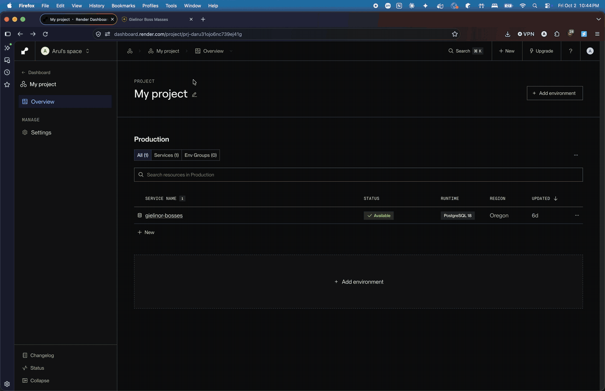

# WEB103 Project 3 - *Gielinor Boss Masses*

Submitted by: **Arul Agarwal**

About this web app: **A virtual community space for RuneScape players who want to find a group boss kill ("mass"). The home page is a map of Gielinor with six clickable regions. Each region has its own page at a slug URL (`/locations/god-wars-dungeon`) listing every mass scheduled there, with a live countdown to each one. An All events page lists every mass in the world, filtered by region and sorted by date. The frontend is React; the backend is an Express REST API over a PostgreSQL database on Render, with `locations` and `events` tables alongside the `bosses` table from Projects 1 and 2.**

Time spent: **2** hours

## Required Features

The following **required** functionality is completed:

<!-- Make sure to check off completed functionality below -->

- [x] **The web app uses React to display data from the API**
- [x] **The web app is connected to a PostgreSQL database, with an appropriately structured Events table**
  - [x]  **NOTE: Your walkthrough added to the README must include a view of your Render dashboard demonstrating that your Postgres database is available**
  - [x]  **NOTE: Your walkthrough added to the README must include a demonstration of your table contents. Use the psql command 'SELECT * FROM tablename;' to display your table contents.**
- [x] **The web app displays a title.**
- [x] **Website includes a visual interface that allows users to select a location they would like to view.**
  - [x] *Note: A non-visual list of links to different locations is insufficient.* 
- [x] **Each location has a detail page with its own unique URL.**
- [x] **Clicking on a location navigates to its corresponding detail page and displays list of all events from the `events` table associated with that location.**

The following **optional** features are implemented:

- [x] An additional page shows all possible events
  - [x] Users can sort *or* filter events by location.
    - Both: a region dropdown filters, and a second dropdown sorts by upcoming first, earliest or latest. Both run server-side through one parameterized query.
- [x] Events display a countdown showing the time remaining before that event
  - [x] Events appear with different formatting when the event has passed (ex. negative time, indication the event has passed, crossed out, etc.).
    - A past mass gets an **Ended** badge, a struck-through title, greyed-out artwork and "Ended 2 days ago" in place of the countdown. Colour is never the only signal.

The following **additional** features are implemented:

- [x] **Loading, empty and error states on every page.** While data loads, skeleton cards hold the layout in place. A region with no masses (Misthalin) says so and links to All events. A failed request shows the server's own error message with a **Try again** button, so the page is never just blank.
- [x] **Screen readers hear results arrive.** Each results area has a polite live region that announces "Loading masses…", then "Showing 6 masses at God Wars Dungeon, 5 upcoming" (or the error). On every route change, focus moves to the new page and the tab title updates.
- [x] **A keyboard-accessible map.** Each region is a real link. You can Tab to it, it shows a visible focus outline, and its label names the region and its upcoming count. Plain clicks route without a page reload; cmd/ctrl-click still opens a new tab. A region list next to the map repeats the same links for small screens.
- [x] **Filters in the URL.** `/events?location=asgarnia&sort=latest` can be bookmarked or shared, and Back undoes a filter change.
- [x] **Real 404s, checked against the database.** `/locations/:slug` answers with a `404` status when the slug isn't in the `locations` table, and React shows a "not found" page. Unknown API paths, slugs and ids get JSON errors, and a bad sort key or location filter gets a `400`.
- [x] **Countdowns that stay current.** Seed times are stored relative to when `npm run reset` runs, so the data always has a mix of upcoming and past masses instead of dates that drift into the past. All countdowns on a page share one timer.
- [x] **Everything goes through Vite.** Components, stylesheets (including Pico) and the map image are imported from `client/src/`, so the build bundles and minifies them and gives them content-hashed filenames. `public/` holds only `favicon.svg`.

## Video Walkthrough

Here's a walkthrough of implemented required features:



The walkthrough shows, in order:
- the `gielinor-bosses` database on the Render dashboard with its status **Available**
- psql connected to it, running `\dt` (the `bosses`, `events` and `locations` tables), `SELECT * FROM locations;` (6 rows) and `SELECT * FROM events;` (17 rows)
- the home page map, then Misthalin's empty state and the God Wars Dungeon page at `/locations/god-wars-dungeon`
- the All events page, with live countdowns on upcoming masses and finished ones crossed out
- The Wilderness at `/locations/wilderness`
- a hand-typed bad location URL returning the 404 page
- the map again, hovering over regions

GIF recorded with macOS Screen Recording and converted with ffmpeg.

## Running the app

```bash
npm run install:all                  # installs client and server dependencies
cp server/.env.example server/.env   # then fill in the five PG* values from Render
npm run reset                        # creates bosses, locations and events and seeds them
npm start                            # builds the client, then starts Express on :3001
```

Then open http://localhost:3001.

`server/.env` needs the **External** connection details from Render (your database → Connect → External). If a
variable is missing, the server refuses to start and says which one. `.env` is gitignored.

For frontend work, run `npm run dev:server` (Express on `:3001`) and `npm run dev` (Vite on `:5173`, with `/api`
proxied to Express) in two terminals to get hot reload against the real data.

## Architecture

```
gielinor-bosses/
├─ client/                        # React app, built by Vite into server/public
│  ├─ index.html                  # app shell
│  ├─ public/favicon.svg          # the only passthrough asset
│  └─ src/
│     ├─ main.jsx, App.jsx        # router: /, /locations/:slug, /events, *
│     ├─ services/                # LocationsAPI.js, EventsAPI.js, request.js
│     ├─ hooks/                   # useFetch (loading/success/error), useNow, usePageTitle
│     ├─ components/              # Layout, GielinorMap, EventCard, AsyncSection, EventSkeletons
│     ├─ pages/                   # Locations, LocationEvents, Events, NotFound
│     ├─ styles/                  # global, map, events (layered on Pico)
│     └─ assets/gielinor-map.png
└─ server/
   ├─ config/
   │  ├─ database.js              # loads .env, creates the pg pool
   │  └─ reset.js                 # npm run reset: rebuilds and seeds all tables
   ├─ controllers/                # bosses.js, locations.js, events.js: the SQL
   ├─ data/                       # seed data: bosses, locations, events
   ├─ routes/                     # api.js mounts bosses.js, locations.js, events.js
   └─ server.js                   # /api, static assets, app shell with real 404s
```

| Route | Response |
|---|---|
| `GET /`, `/events` | `200` · app shell |
| `GET /locations/:slug` | `200` · app shell if the location exists, `404` if it doesn't |
| anything else | `404` · app shell (React shows the not-found page) |
| `GET /api/locations` | every location, with `eventCount` and `upcomingCount` |
| `GET /api/locations/:slug` | one location, or `404` |
| `GET /api/locations/:slug/events` | that location's events, upcoming first, or `404` |
| `GET /api/events` | every event; `?location=<slug>` filters, `?sort=upcoming\|earliest\|latest` sorts; `400` for an unknown value |
| `GET /api/events/:id` | one event, `400` for a non-integer id, `404` if missing |
| `GET /api/bosses`, `/api/bosses/:slug` | unchanged from Project 2 |

## Database

`locations` has one row per region on the map:

| Column | Type | Constraints |
|---|---|---|
| `id` | `SERIAL` | primary key |
| `slug` | `VARCHAR(100)` | not null, unique, lowercase words joined by hyphens |
| `name` | `VARCHAR(255)` | not null |
| `region` | `VARCHAR(255)` | not null |
| `description` | `TEXT` | not null |

`events` has one row per scheduled mass:

| Column | Type | Constraints |
|---|---|---|
| `id` | `SERIAL` | primary key |
| `location_id` | `INTEGER` | not null, references `locations`, `ON DELETE CASCADE`, indexed |
| `boss_id` | `INTEGER` | references `bosses`, `ON DELETE SET NULL` |
| `title` | `VARCHAR(255)` | not null |
| `host` | `VARCHAR(255)` | not null |
| `world` | `INTEGER` | not null, > 0 |
| `starts_at` | `TIMESTAMPTZ` | not null, indexed |
| `description` | `TEXT` | not null |

`bosses` is the Project 2 table, unchanged. `starts_at` is a `TIMESTAMPTZ`, so the API sends an unambiguous UTC
instant and the browser shows it in the viewer's own time zone. The event rows join in the location and boss, so
an event card can render from one request.

## Notes

**Vite's `public/` folder skips the build.** In Project 2, every script and stylesheet lived in `client/public/`,
which Vite copies through untouched: no bundling, no minification, no hashed filenames. Here everything is imported
from `src/`, including Pico (previously loaded from a CDN) and the map image. The build emits
`assets/index-[hash].js`, `index-[hash].css` and `gielinor-map-[hash].png`, so a deploy can never serve a stale
cached copy.

**Pico adds its own UI to some attributes.** It draws a spinner before any element with `aria-busy="true"` and puts
a zero-width `::before` on every `nav li`. The spinner doubled up with the skeleton cards, and the `::before` became
a third flex item that pushed the region list's links sideways. Both are switched off in the app's CSS.

**SVG has no `<Link>`.** React Router's `<Link>` renders an HTML `<a>`, which isn't valid inside an `<svg>`. The map
hotspots are SVG `<a href>` elements that call `navigate()` on a plain click and let modified clicks through.

**The starter's map wiring fights React.** It attaches `mouseover` listeners with `querySelectorAll` after the data
loads and points the hotspots at hard-coded routes (`/echolounge` → `index={1}`). Here, hover and focus effects are
CSS, and routes are one `/locations/:slug` pattern, so adding a location is a database row plus a polygon.

**Old responses can overwrite new pages.** Switching filters quickly could let a slow response for the previous
filter land after the current one. `useFetch` aborts the previous request whenever its inputs change.

## Credits

Boss artwork, statistics and the map of Gielinor are © Jagex, sourced from the
[RuneScape Wiki](https://runescape.wiki) and used under
[CC BY-NC-SA 3.0](https://creativecommons.org/licenses/by-nc-sa/3.0/). The map image is included in this repository
under that license; boss images are loaded from the wiki. Clans, hosts and events are made up.

## License

Copyright 2026 Arul Agarwal

Licensed under the Apache License, Version 2.0 (the "License"); you may not use this file except in compliance with the License. You may obtain a copy of the License at

> http://www.apache.org/licenses/LICENSE-2.0

Unless required by applicable law or agreed to in writing, software distributed under the License is distributed on an "AS IS" BASIS, WITHOUT WARRANTIES OR CONDITIONS OF ANY KIND, either express or implied. See the License for the specific language governing permissions and limitations under the License.
